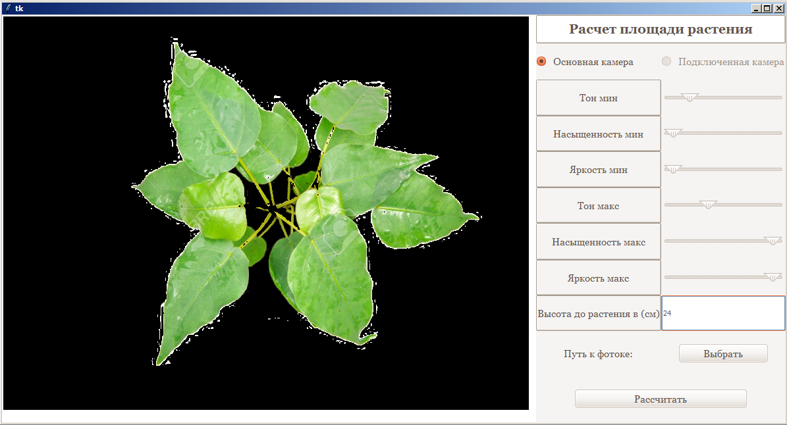

# ImageProcessing-Project-KazATU
### My project for calculating area of a plant based on an image

Roughly calculates leaf area based on precalculated polynomial formula.
Takes pictures with both webcamera, connected USB camera or even jpeg images. 
 
Screenshot 

